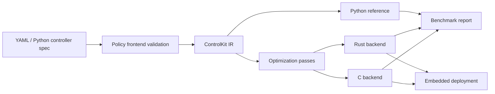

# ControlKit Architecture Diagram

```mermaid
flowchart LR
  spec["YAML / Python controller spec"]
  frontend["Policy frontend validation"]
  ir["ControlKit IR"]
  opt["Optimization passes"]
  c["C backend"]
  rust["Rust backend"]
  py["Python reference"]
  bench["Benchmark report"]
  embedded["Embedded deployment"]

  spec --> frontend
  frontend --> ir
  ir --> opt
  opt --> c
  opt --> rust
  ir --> py
  c --> bench
  rust --> bench
  py --> bench
  c --> embedded
  rust --> embedded
```

Supported policy families today:

- LQR feedback controllers
- MPC-lite finite-horizon controllers
- fixed-shape RL MLP policies
